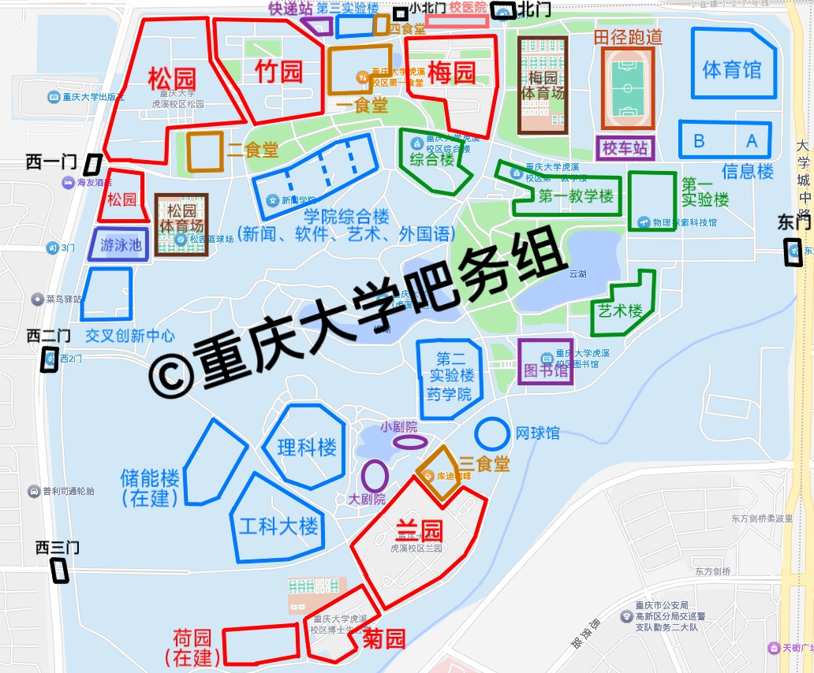
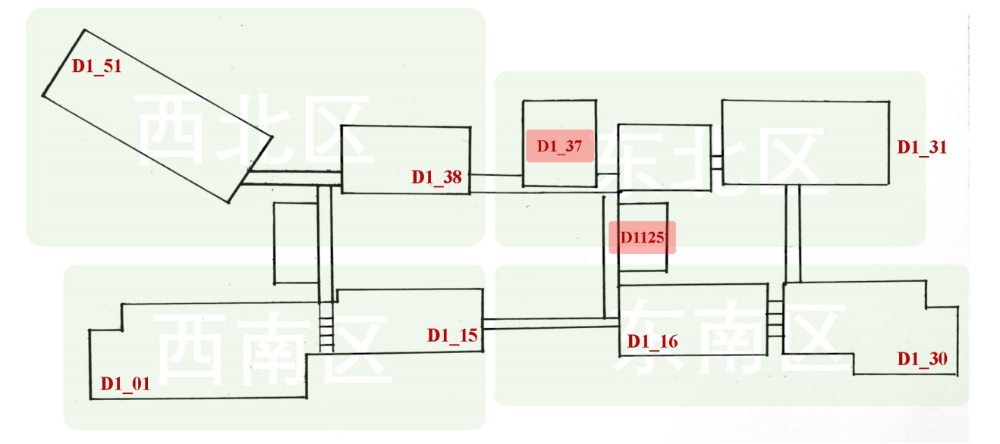
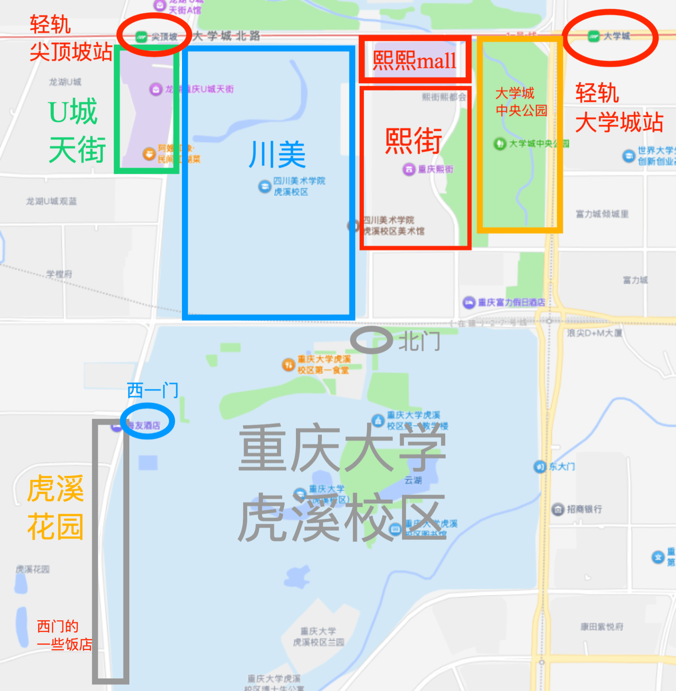
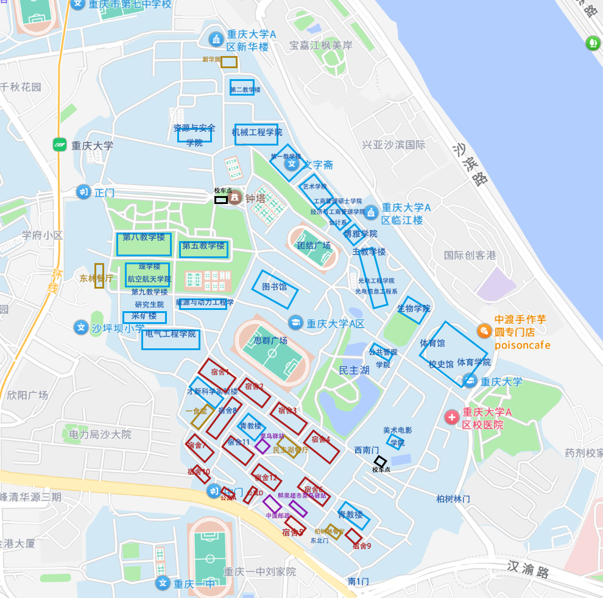
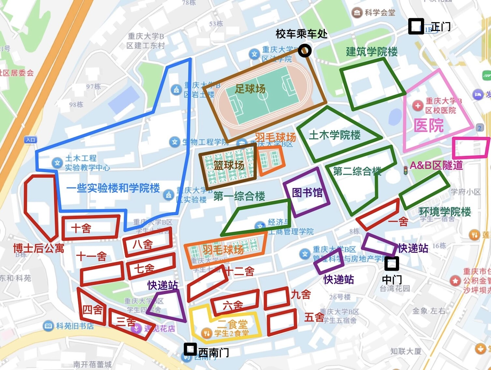
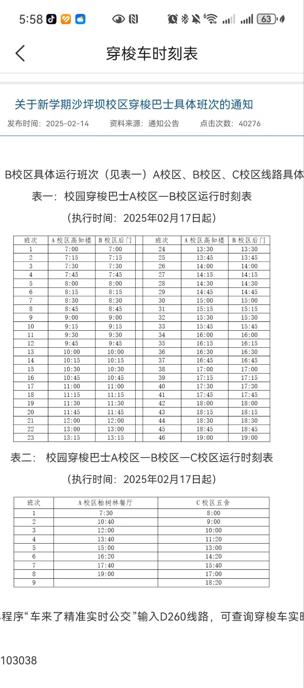

@ [tazy_wrld](../../contributor/tazy_wrld.md)、 @ [重庆大学吧务组](../../contributor/重庆大学吧务组.md)

## 1. 前言
欢迎来到重庆大学！  
相比往年，重大今年的校区安排与一些学校设施有比较大的变动，过往的一些新生指南有些内容落后于现况。因此，我们撰写了新的新生指南，旨在让新同学们对于大学期间的学习生活情况有一个大概的了解，并解答新同学们对于在重大学习生活的一些相关疑问。希望本文能对同学们即将到来的、崭新的大学生活有一些帮助。  
祝各位度过愉快的大学生活！  

## 2. 报到流程与防诈骗

#### 2.1 从录取到入学
确定录取后，很多同学询问暑假是否需要提前购买资料或是学习一些课程，我的个人经验是没有太大的必要，开学后认真对待学业完全够用。不必太焦虑，这个暑假度过一个愉快的夏天即可。  
收到录取通知书后，通知书内会附有学校官方的年级群二维码，群内会发开学流程的相应通知和要求，如报到时间、流程、需要准备的材料等，报到流程主要在今日校园APP的智慧迎新上完成，到校只需完成线下迎新点签字、领取饭卡、收拾宿舍等流程，本文就不再赘述了。  
开学建议携带的物品有主要就是衣物（带夏天、秋天的即可，冬天的可以稍后让家里寄）与需要携带的材料与证件（会通知）。其他生活用品可以寄到学校（如床上用品等体积较大的）到校再去学校边超市购买/网购，非常方便，{==重庆九月份很热，没必要携带太多东西。==}  

#### 2.2 防诈骗
防诈骗一直是新生所需要注意的重点。首先需要明确的是，{==对于任何必须要购买的物品/要做的事，辅导员一定会在群里通知==}。因此，无论线上线下，不要轻信一些学长/学姐（很多骗子甚至不是本校学生，会装成本校学姐进行推销）。为了提成，一些骗子会进行虚假宣传误导欺诈同学们。{==任何宣称某物是必须购买的几乎都是骗子==}，可以不用理会。  
介绍一些常见骗局：

- 网恋/裸聊/游戏充值/刷单/兼职群：常规的诈骗方法，但学校每年依然有人上当，大家网络冲浪时务必擦亮双眼，不要一时上头被骗走钱财。  
- 被子/床上用品：开学军训时会有一套比较基础的床上用品（23和之前年级都有，24级没有，不知道25级会不会有）可自己选择是否购买。可以应急先用着，后面再网购床上用品。网上卖被子的学长/学姐售卖的被子大多质量较差，价格也比较贵，不建议购买！  
- 校园卡：校园卡指电信/移动/联通的电话卡，不是必须要办理的。下文4.4段会详细介绍，同学们可以根据自己的需求购买。  
- 卖笔/文具：校内外可能会有声称学长学姐实习卖笔的，{==基本都是校外人员进行诈骗==}，卖的文具大多价格非常昂贵且非常不好用，每年都有不少新生被骗大量钱财。遇到可以直接走开，{==如果纠缠不清直接说要打电话报警/找保卫处即可==}。  
- 英语课（英语角）：开学前可能会有人加好友，以及开学后的校内外可能会有在路上拦住问你想不想了解一下英语课/英语角的，声称对四六级/雅思托福有帮助，实际上基本上没什么用处，基本最后都会拐到付费上课。如果是纯兴趣，请关注开学后的社团活动。同样的，如果纠缠不清直接说要打电话报警/找保卫处即可。  
- 其他：除了以上常见骗局，每年都有不少新的骗术，本文难以全部涵盖。如果遇到陌生链接/银行卡信息/验证码/转账等相关情况，同学们务必多留心，有些不好判断的可以咨询辅导员。  

## 3. 校区概况

#### 3.1 总览
重庆大学目前主要有位于大学城的虎溪校区，位于沙坪坝区中心、临近三峡广场的A、B、C校区（一般统称为老校区），两江校区，以及建设中的智谷校区。其中，C区为医学院，两江校区为卓越工程师学院，大部分同学的大学生涯主要和虎溪校区以及A、B校区有关。  
以下专业的25级新生大一会先在老校区就读：电气工程、工科试验班（计算机与智能软件）、工科试验班（未来信息）、工科试验班（卓越计划）、工科试验班（经济管理类）、人文科学试验班（法学新闻类）、建筑类、电影学院、马克思主义学院，其他专业/大类都会在虎溪校区。每个学院后续是否搬宿舍及搬迁具体情况不同，需等待学院通知。  

#### 3.2 教室名称
重大的教室命名规则为校区名+楼栋名+房间号  

- A校区  
    - 主教学楼「A主xxx」  
    - 二教学楼「A2xxx」  
    - 五教学楼「A5xxx」  
    - 七教学楼「A7xxx」  
    - 八教学楼「A8xxx」  
    - 理科楼「A理xxx」  
    - 研究生院「A研xxx」  
- B校区  
    - 二综合楼「B二xxx」  
- 科学城校区虎溪校区（D校区）  
    - 一教学楼「D1xxx」  
    - 综合楼「DZxxx」  
    - 艺术楼A「DYAxxx」  
    - 艺术楼B「DYBxxx」  
    - 艺术楼C「DYCxxx」  
    - 第一实验楼「DS1xxx」  
    - 第二实验楼A「DS2Axxx」  
    - 第二实验楼B「DS2Bxxx」  
    - 第三实验楼「DS3xxx」  
    - 一食堂三楼「DHxxx」  

在了解了教室命名规则及对应的编号含义后，相信大家可以理解教室编号所对应的校区、教学楼及教室了。建议新同学们在正式上课前可以先去逛几圈，对教学楼及教室有个大概了解，以免上课时找不到教室导致迟到。  

#### 3.3 科学城校区虎溪校区介绍

虎溪校区位于大学城，是重大较新的一个校区；附近有熙街和龙湖U城，以及川美、重师、重医等高校。校区主要的建筑物图中已经标明。大致介绍一些比较重要的建筑物：  

- 第一教学楼、综合楼、艺术楼：平时上课的主要场所。其中，大部分课会在一教，一些思政类课程会在综合楼或是艺术楼。  
- 各宿舍区：梅、竹、松园主要为本科生，兰菊荷园主要为研究生。其中，距离一教最远的松园步行到达一教的时间约15分钟。  
- 一食堂、二食堂：离宿舍区较近的两个食堂，也是大家去的比较多的食堂。下文会具体介绍。  
- 图书馆：重大的标志性建筑，可以借书，也有很多座位可自习，刷脸进入即可。
- 快递站、校车站：分别是取快递和乘坐校区间校车的地方。可查看[校车时刻表](../../life/校车时刻表.md)

虎溪校区中间为一座小山，最高处有个亭子，天气好的时候大家可以上山逛逛。其他的一些建筑，大家在虎溪生活的时候可能多少会接触，在此不一一赘述，大家可以在学习生活中慢慢探索。  

一教是虎溪校区最重要的教学楼，其内部构造又十分复杂，新同学非常容易迷路。这里大概介绍一下。

这是一教大致的构造及对应的教室名字。教室命名规则在3.2已介绍，D指虎溪校区，第一位数字1指一教，第二位数字为楼层，后两位数字为教室编号。  
以一楼为例，D1151-D1138在一教一楼的左上角，从西北区进入一教的第一间教室是D1151，往前走到西北区的尽头为D1138，继续往前走就到了东北区，尽头为D1131。  
需要注意的是，在四层与五层，西区与东区没有走廊连通（如D1415与D1416），必须走到对应的区域再上楼。例如，如果想前往D1416教室，必须走到东南区的三楼随后上楼，而在西南区的四楼无法到达东南区的四楼。  

虎溪校区周边如图所示，北门对面是川美，北门往北是熙街，有许多餐饮店；再往北是轻轨路线，左边靠近U城天街商场的是尖顶坡站，右侧为大学城站。西门外也有一排临街的店铺。  

#### 3.4 A校区介绍

A区位于沙坪坝区中心，一侧与B区隔着沙正街，一侧临江，附近有欣阳广场、三峡广场等商业街，是重庆大学最有历史积淀的校区，生活气息比较浓厚。大致介绍一些比较重要的建筑物：  

- 教学楼：第五教学楼，第八教学楼是平时上课的主要场所，从寝室楼步行大约7至15分钟。  
- 快递站：顺丰和中通在鲜果超市菜鸟驿站，其他在民主湖旁边的菜鸟驿站。
- 校车：A区校车点在钟塔和后门。可查看[校车时刻表](../../life/校车时刻表.md)
- 校医院：校医院在校外，从后门走出后向左，上坡步行100m左右。
- 图书馆：A区图书馆氛围感很好，但是相对虎溪座位比较少。
- 食堂：一食堂离寝室比较近，适合早餐；民主湖餐厅和柏树林餐厅窗口多，东林窗口少但味道都不错；新华园比较远，自选菜性价比高。

A区（及B区）附近的商业街主要为欣阳广场和三峡广场。  

#### 3.5 B校区介绍

B校区原为重庆建筑大学的校区，经历合并后现在主要为建筑学部（土木工程学院、建筑城规学院、环境与生态学院、管理科学与房地产学院）所在地。校区构造相对简单，和A区隔着沙正街，有一条地下隧道可以在校区之间来回。主要建筑物有：  

- 第二综合楼：主要上课的地点
- 二食堂：位于西南门对面，有面包店和各式档口。
- 快递站：有中门快递站、西南门快递中心、管科学院快递站三个快递站。
- 学院楼和实验楼：B区实验楼比较多样，在相关楼栋上课的时候可提前了解要前往的学院楼/实验楼所在位置。
- 校车乘车处位于足球场旁与毛主席雕像旁，上坡即是B区正门。

## 4. 生活相关

#### 4.1 信息平台

在校生活离不开一些便捷的信息平台，在此推荐一些比较常用的公众号、小程序等。  

- 网站
    - [https://my.cqu.edu.cn](https://my.cqu.edu.cn)：重庆大学智慧教务，可查看课表、培养方案、学分详情等，选课也是用这个网站。
    - [https://i.cqu.edu.cn/new/index.html](https://i.cqu.edu.cn/new/index.html)：重庆大学网上服务大厅，功能较多，可查看校历、校车时刻、体测成绩、报修等。
    - [https://atrust.cqu.edu.cn](https://atrust.cqu.edu.cn)：重庆大学内网VPN，在校外时可访问重大校内网络。
- 小程序
    - 321cqu和wecqu：绑定个人信息以后可以查看课表、考试成绩与考表、考场安排、电费余额及饭卡余额等，比较推荐。321cqu比较简约好用，wecqu更齐全，建议搭配使用。
- 微信公众号 & 服务号
    - 重大虎溪：可查看校车时刻表与校历等信息。
    - 重大财小通：交学费，充值饭卡、宿舍电费的平台。
- APP
    - 今日校园：在电子证件里开通身份二维码后可以替代饭卡刷食堂和门禁等。还有一些其他功能如节假日登记等。
    - 校钉：宿舍洗澡热水缴费。

除了上述平台，同学们也可以使用百度贴吧-重庆大学吧、校园集市、小红书等平台。  

#### 4.2 交通

##### 4.2.1 校内交通
- 科学城校区虎溪校区
    - 目前虎溪不允许新的电动车上牌，通行方式主要有步行、自行车和乘坐小白。
    - 从各宿舍区步行到一教时间不等，最远的松园到一教约15分钟。当然，去艺术楼就更远了。自行车可自行在网上购买，或是在二手群里收学长的自行车，在毕业季往往很便宜。梅/竹园距离一教较近，个人感觉购买必要不大；建议入学后根据实际往返宿舍、教学楼的体验和个人需求决定是否购买。
    - 小白指的是校内定点运营的电动车，有点类似校内的“公交”，乘坐一次车费1元，扫码支付。大概十几分钟左右一趟，末班车时间大概为21:30，有时候会提前一些。具体路线为：
        - 上下课高峰时段
            - 三食堂 > 艺术楼 > 一教中间 > 十字路口 > 一食堂南广场 > 二食堂
            - 二食堂 > 学院楼 > 十字路口 > 一教中间 > 艺术楼 > 图书馆 > 三食堂
        - 中午 12:00 - 12:30
            - 艺术楼 > 一教中间 > 十字路口 > 大北门 > 快递点 > 二食堂
        - 其他时段
            - 三食堂 > 艺术楼 > 一教中间 > 十字路口 > 大北门 > 快递点 > 二食堂 > 学院楼 > 十字路口 > 一教中间 > 艺术楼 > 图书馆 > 三食堂 > 理科大楼
            - 三食堂 > 艺术楼 > 一教中间 > 十字路口 > 学院楼 > 二食堂 > 快递点 > 大北门 > 十字路口 > 一教中间 > 艺术楼 > 图书馆 > 三食堂 > 理科大楼
- ABC校区
    - 由于学校内坡较多，不太建议骑自行车，主要为步行出行。A、B区也有校园巴士，班次和时间如图

##### 4.2.2 校间交通
虎溪校区与A、B、C区间也有固定的班车，以方便同学们跨校区上课的需求，价格为6元。需要注意的是，如果需要前往C区，上车的时候需要和师傅说声（大部分师傅也会问一下），不然默认是不停C区的。可查看[校车时刻表](../../life/校车时刻表.md)

##### 4.2.3 校外交通

本段主要介绍各校区到机场/火车站之间的交通方式。

- 科学城校区虎溪校区
    - 建议将重庆大学虎溪校区北门设置为导航目的地
- A校区
    - 建议将重庆大学A区中门设置为导航目的地
- B校区
    - 建议将重庆大学B区西南门设置为导航目的地

- 公共交通：参见地图导航推荐方式和路线，不再赘述。对于虎溪校区，轻轨大学城站/尖顶坡站距离北门有一定距离。如果行李较多，{==推荐从轻轨站打个车到北门==}。老校区的地铁站出门即是A/B区正门，非常方便。
- 打车：建议乘坐网约车，分别将上述校区的对应地点设置为导航目的地。注意不要乘坐在机场/车站揽客人员的车辆，有些是会宰客的不打表黑车。

此外，虎溪校区北门有正在建的地铁线路，预计27年开通，届时虎溪校区可能也能享受老校区出门即是地铁站的待遇。

#### 4.3 餐饮

##### 4.3.1 食堂
重大校内食堂的档口数量众多，菜式多样，能满足同学们对于各种口味的需要。如果是不吃辣的同学来到重大也不用担心。虎溪共有四个食堂，其中一食堂靠近梅园、竹园，二食堂靠近松园，三食堂靠近兰园。四食堂为清真食堂，位于一食堂靠体育学院一侧的后门外面。B区有位于西南门的二食堂，A区有一食堂、民主湖食堂、柏树林食堂以及靠近正门的东林食堂。校内食堂需要刷学生卡/今日校园身份二维码支付，并在重大财小通公众号上充值，一般一餐价格十几元。一般来说，吃完需要将餐盘放到回收处（虎溪二食堂顶楼不用）。   
虎溪校内有库迪咖啡、蜜雪冰城等店铺，老校区校内也有瑞幸咖啡、库迪咖啡、7-11便利店等，B区有正在装修的肯德基，不知道具体开业时间。   

##### 4.3.2 外卖
外卖无法送进校园，一般要到指定的地点去拿外卖。不太建议使用校园送功能，非常慢，有时候还会搞丢外卖。  
需要注意的是，由于没有外卖柜，{==外卖挂在学校栏杆上有被校内外人员偷走的可能==}，时常会出现外卖被偷的情况，且追查较为麻烦。建议在外卖快要送达时提前到取外卖的地方等候，外卖员到达时直接从外卖员手里拿外卖以避免被偷。  

校内点外卖地址：

- 科学城校区虎溪校区
    - 梅园：重庆大学虎溪校区小北门
    - 竹园：重庆大学虎溪校区竹四或竹五围栏
    - 松园：重庆大学虎溪校区西一门/松二或松三楼下围栏（视距离远近）
    - 兰园等研究生宿舍：只能送到西二门或是东门，距离较远
- A校区
    - 宿舍：重庆大学A区中门（大多数情况下）/南一门（5，6，9舍）
    - 教学楼：重庆大学A区正门
- B校区
    - 重庆大学B区西南门/中门（中门外卖柜仅支持美团）

##### 4.3.3 校外餐饮

如果想改善一下伙食，可以去校外的饭店或是商业广场。在此推荐几个同学们常去的地点。

虎溪：西门外过马路的一条街上有不少小吃如猪脚饭、抄手、沙县等；北门外也是一条商业街，往前一直走就是熙街，是整个大学城的商业中心，有许多火锅烤肉等店铺。川美对面的U城天街（轻轨尖顶坡站）也是比较大的商场，有许多餐饮和一个电影院。

A、B区：老校区周边的饭菜都比较有重庆特色。A、B区中间的沙正街上小饭馆和摊贩较多，到了晚上有很多摆摊卖各种小吃的；稍远一些的三峡广场以及沙坪坝站边的金沙天街就有种类比较繁多的餐饮，各种火锅烤肉等。

##### 4.3.4 [饭协](../../life/学生团体/饭协.md)

推荐一下校内同学创建的美食协会，群内主要讨论重大校内外美食评价及探店日常等。群内也有同学们评出的“饭协红黑榜”，欢迎加群了解。`705248215`

#### 4.4 校园卡与校园网

可查看 [重庆大学校园网那些事](./重庆大学校园网那些事.md)

#### 4.5 快递

各校区快递地址直接填重庆市重庆大学XX校区即可。

- 科学城校区虎溪校区
    - 取快递地点在竹四后的快递站。
- A校区
    - 顺丰和中通在鲜果超市，其余在民主湖食堂旁快递站。
- B校区
    - 韵达、顺丰在中门快递站，其他随机在西南门快递中心或管科学院快递站。

#### 4.6 宿舍

虎溪的本科生宿舍主要集中在梅、竹、松园，标准配置为上床下桌四人间加独立卫浴，每栋楼的一楼有洗衣间，里面有洗衣机与烘干机；每层楼有一间活动室。宿舍楼扫脸出入，虎溪校区宿舍晚上关门时间为23:00，老校区为24:00，超过此时间回宿舍需要打宿管电话开门。辅导员能查看宿舍门禁刷脸情况，如果有无故晚归/夜不归宿的情况辅导员可能会询问你情况，如果有需要尽量和辅导员请假，同时外出（尤其是晚上）务必注意安全。晚上学校大门并不会关，宿舍全天不断水不断电，热水有使用时段（详见校钉APP）。宿舍禁止使用大功率违规电器如洗衣机、电磁炉等，{==以前曾出现过同学在宿舍做饭引起火灾的情况，还是建议同学们时刻以安全为先==}。  
宿舍床铺规格不一，老校区为1.9m×0.9m，虎溪为2m×0.9m（虎溪梅六、竹一为1.95mx0.8m）。床上用品市内新生可以从家里带，市外的建议直接邮寄到学校或是到校网购。不建议购买可能有人向你推销的被子，通常价格高质量也差。学校附近也有永辉、乐而乐等超市，可以选择到校后去超市购买（同理，洗漱用品、洗衣液等生活用品也建议网购或来到学校再买）  
往年学校会发一套六件套的床上用品（24级没有，往前的年级都有，不知道今年还会不会有），需要花钱购买，价格不贵但质量一般，比较薄只能夏天用。这套床上用品也不是军训必备的，大家可以按需购买。  
大一开学舍友为随机分配，大一结束分流时会重组并搬宿舍，可以在分流到的学院内任组（部分学院为班内组），可以在大一认识一些生活习惯相近、准备分流至同一学院的朋友在分流时一起组宿舍。  

#### 4.7 便利店与打印店

##### 4.7.1 便利店

为满足同学生活需要，校内有一些便利店，主要提供日用百货、零食饮料等。

- 科学城校区虎溪校区
    - 天猫超市：位于虎溪校区二食堂负一楼，商品种类较多。
    - 七彩超市：位于竹园五栋楼下。
    - 重报生活梅园超市：位于梅园三栋楼下，旁边有个水果店（但价格较贵）
    - 重报生活松园超市：位于松园五栋A厅楼下。
    - 三食堂七彩超市：位于三食堂，离兰园较近。
    - 一教便利店：位于一教与校车站中间，有一些零食饮料售卖。
    - 快递站超市：快递站也是一个大超市，位于竹园四栋旁。
- A校区
    - 7-11：A区ACD楼门口。
    - 优选精品超市：A区ACD楼层底，中门旁边；还有一家位于六舍楼下。
    - 罗森：优选精品超市对面，中门旁边。
    - 东林超市：能源与工程学院旁。
    - 此外，A区便利店较多，难以一一全部列出，同学们可到校后在校园内逛逛，自行了解
- B校区
    - 惠选校园超市：B区十二舍楼下。
    - 罗森：B区西南门斜坡上左转。
    - 7-11：B区十二舍楼下。
    - 孝香副食：位于B区第二综合楼对面，主要有零食饮料等。
    - 重大青年便利店：位于B区中门、菜鸟驿站旁。
    - 美宜家：西南门进门左手边，旁边还有一排超市。

需要注意的是，校内便利店价格、商品品质不一，同学们务必注意甄别筛选。此外，虎溪西一门外、B区西南门外、A区中门外上坡50m都有乐尔乐特价超市，东西比较便宜实惠，各类生活用品也比较齐全，有需要的同学可前往购买。

##### 4.7.2 打印店

在校内难免遇到需要打印各种文件的情况，在此也列出校内外一些打印店。

- 科学城校区虎溪校区
    - 校内打印店分别位于综合楼、兰园、信息大楼A栋4楼，校外的主要在西一门外。兰园打印店（唐印文化）可以打印一些往年的试卷真题，有需要的同学可以了解。
- A校区
    - 分别位于南一门重大花园门口、六舍超市楼上、电气工程学院旁边（保卫处对面）。
    - 自助打印机分别位于八教二楼教师沙龙、五教二楼茶水间、图书馆一楼（靠近思群广场看台门，但价格较贵，质量也不太好）。
- B校区
    - 西南门进门左手一排商铺中有一家，十二舍楼下、库迪咖啡旁有两家，管科学院后靠近中门有两家、西南门对面天桥下也有一家。
    - 二综内3、4、5楼及三舍一楼有自助打印机。

## 5. 学习相关

#### 5.1 英语入学分级考试

详见[英语](../../course/英语.md)

#### 5.2 军训

开学之后首先要面对的就是军训。整体而言，军训的强度不会很大，不用太紧张，总共21天，其中前14天为室外军训，后7天为室内的军事理论课。教官由本校退伍回来的学长/旁边军校的在校生/民兵组成，如果是本校学长担任教官的话基本都比较松，而且前几天会相对严格，后面会陆续放松一些，基本都在阴凉的地方训练。教官也怕大家中暑或是身体不适，会强调{==如果身体不舒服不能坚持的话打报告去旁边休息==}。  
军训对头发长度和颜色要求不会很严格，帽子能盖住就还好，如果有查寝的话也不会很严格（具体尺度也看教官）。军训服装由学校统一订购，不用担心尺寸，军训前会线下领取并当场试穿，不合身可以立刻换。军训服晚上训完之后可以马上洗了晾好，基本上一晚上就干了。军训鞋为胶鞋，鞋底很硬很薄，建议买个鞋垫垫着。  
军训建议提前购买的物资： 鞋垫（个人认为必备），腰带（根据裤子合身成都考虑是否购买），防晒霜，装水用的水杯（或在便利店买水）；清凉油等防中暑药物。  
可见[必备物品](./必备物品.md)

#### 5.3 二次选拔

入校后，会有二次选拔的机会，分别是弘深学院的计算机拔尖班和国家卓越工程师学院的明月科创实验班。在此将对这两个学院的招生计划进行大致介绍。

{==二次选拔对同学们来说是一个机会，但实际情况绝不是弘深/明月一定优于某专业==}。本文只对二者进行了大致的介绍以供同学们参考，建议同学们理性判断，有意向参与选拔的同学建议多了解目标学院的学习、生活情况后慎重决定。

（注：信息来源主要是一些正在对应学院就读的学长学姐，每年的政策都在变动，本文所述内容仅供参考、不一定完全正确，以学院具体文件和政策为准。建议感兴趣的同学在学院官网查看往年的二次选拔规则、推免规则等，或是直接在线上/线下询问学院相关招生老师。）

##### 5.3.1 弘深学院

目前强基计划的数学、物理专业都在弘深学院，而二次选拔的只有计算机班。选拔包含笔试、综合面试，都通过后有2000/2400m的体能测试。笔试科目是英语和数学，两科考试都是高考难度；面试考察学生的兴趣志向、创新能力、科研潜质和综合素养（学长经验：考察了对计算机知识的简单理解）。综合笔试、面试成绩后决定出录取名单，随后进行体能测试，不合格者不能录取。  
进入弘深学院后主要为小班制上课，作业与考试要求与普通班可能不一样，具体看老师。每年的保研推免政策具体要求可能有部分变动，今年大致为如下要求（同样仅供参考，以学院具体政策为准）：无挂科记录，绩点3.0+；有作为组长主持一次科研训练（srtp，大创等）的经历，以及一定的科研成果（一作发表论文/发明专利/学院认可的竞赛拿到国三等）。据传弘深学院内卷程度比较高，在学院就读也会有一定压力，有意向进入的同学可结合自身情况谨慎考虑。  

- 信息查询及联系方式
    - 弘深学院官网：[https://hshc.cqu.edu.cn](https://hshc.cqu.edu.cn)
    - 学院地点：虎溪校区弘深学院楼 B3-206
    - 电话：`(023)65678801`、`(023)65678802`

##### 5.3.2 国家卓越工程师学院明月科创实验班

明月班每年将在十月初面向大一新生进行二次选拔，选拔人才目标为“创新型人才”（大概就是要有创新精神，动手能力，创业想法）。选拔考试为项目型测试，出题老师给一个想法，不限方式去实现即可（比如22年题目为1分钟计时器）。项目测试完成后会有一次面试，院长和任课老师会亲自面试每一名考生。项目测试和面试通过后，将通知考生确认转入明月班。明月班目前开设专业为机器人工程和人工智能，均在大三开放选择。  
进入明月班后，授课方式将与其他专业不同，院长称之为项目制教学，即老师仅仅带领各位同学入门，并在开课几周之内给出期末考试项目，根据该项目展开学习，个性化的课程考核制度将与其他专业不同。考核制度仍然为项目制考核，这种项目制教学，纸面考试没有或者占比分数少，项目测试分占比很高，只要在期末交出你的项目成果，课程的分一般不会很低。  
关于保研政策，明月班目前保研率和本科生院应该是持平的。并且，明月班的保研加分项及其不同，其他专业可以加分的各种竞赛，均不能加分。唯一加分项为学校与校外企业合作明月湖创业基地的创业加分，即在大二大三左右，组队找到一个创业题目，通过考核后能获得一定的绩点加分，并为班级累计一个保研名额（同样仅供参考，以学院具体政策为准）。  
整体来说，明月科创实验班教学方法较新，项目制教学比较需要同学们的学习能力（例如作为工具一周学会使用3Dmax，一周学会使用MATLAB等）、动手能力和小组合作能力，比较适合有较强精力、自制力、自主学习能力的同学。  

- 信息查询及联系方式
    - 卓越工程师学院官网：[https://eie.cqu.edu.cn/index.htm](https://eie.cqu.edu.cn/index.htm)

#### 5.4 成绩组成、学分、绩点、综测、挂科与重修

新同学或多或少会听说这几个词，但可能不清楚具体含义以及规则，在此解释一下。

- 成绩组成
    - 一门课的成绩组成分有期末考试成绩和平时成绩（有些课程还会有期中考试成绩），而各课程的各部分占比不同。平时成绩主要包含出勤、作业等，能拿满还是尽量拿满。同时，也有一些课程（主要为选修课）没有期末考试，考核方式为交论文等。
- 学分
    - 根据完成课程所需要的课时、难易程度等因素，每门课程都会有相应的学分。一门课的最终成绩大于等于60分，即视为该课程通过，拿到这门课的学分。毕业需要修够各个板块对应的学分，可在智慧教务网站-个人修读情况里看到自己修过的学分，以及毕业所需要的学分。
- 绩点
    - 每门课的最终成绩对应该课程的绩点，60分合格为1.0，而90分为满绩4.0。计算整体绩点时，则是把各门课的绩点根据学分进行加权平均，即一门课的学分越多，这门课的成绩对宗绩点影响越大。绩点对于根据绩点分流的大类和保研比较重要，也较大比重。
- 综测
    - 评奖评优（如拿奖学金）的标准，影响综测的主要是绩点以及一些加分的项目。换句话说，对于不考虑评奖评优的同学可以不用太考虑综测。
- 挂科与重修
    - 如果一门课的最终成绩低于60则是不及格，必修课在下学期开学前会有一次补考，如果选修课没有补考或是补考也挂了就需要重修。重修需要交额外的学分费用（1学分80元），也需要占用更多时间，建议同学们还是尽量避免挂科与重修。

#### 5.5 选课与教材

新生选课在军训的最后一周。可以提前在智慧教务上了解本专业所需要修的课程，大一的公共基础课基本是固定的，主要是选上课的老师，可以提前在321cqu上看看每个老师的平均分和挂科情况，或询问学长学姐。选课不需要校园网推荐使用电脑或者平板。现在实行志愿选课，不需要抢课，只需要在规定时间内填好自己的选课志愿就好，系统会随机抽签。对于日后的必修、选修及通识、非限课程情况可自行向同学或教务了解，在此不详细介绍了。  
通常在第一堂课上，老师会说需要购买教材的版本。教材主要有如下获取情况：梅园书店有全新教材出售（不推荐，非常贵），北门外有二手书店可以购买（价格比梅园书店要低），同学们也可以在网上购买二手书，有平板的同学可以下载pdf版本的电子书。一般来说，只需要教材的版本正确，老师不会限制教材的情况，新书/二手/电子版都可以，可根据自身情况选择。  

#### 5.6 晨曦计划、步道乐跑与体测
晨曦计划主要在本科生院执行。需要同学们在一学期内在指定时间（早上7：25到7：35打卡，8:00-8:30退卡）、指定地点（操场、教学楼等）打卡满一定次数。晨曦打卡会影响综测，24级政策为全勤55次及以上记为2分；出勤次数达到35次，获得基本分1分；出勤次数在35次至55次之间，每增加1次在基本分1分的基础上加0.05分；出勤次数未达到35次，无晨曦活动加分。诚然，晨曦计划能让同学们有一个良好的作息，{--但学院也不会强制执行，如果不在意综测并且实在不想去的话不去也是可以的--}。  
步道乐跑是体育课成绩的一环，一般在体育成绩中占10分，需要使用步道乐跑APP需要在一学期内打卡30次，每次配速4-9min/km跑3km，并途径两个打卡点。{--有部分同学会使用骑车/坐小白的方式完成打卡--}。  
体测指的是大学生体测，每年的秋季学期都会有一次，项目有长跑、肺活量、跳绳、引体向上/仰卧起坐、立定跳远等，具体评分标准可在网上查询。毕业的体测成绩占比为大一～大三体测成绩占50%，大四体测成绩占50%，需要达到50分才能毕业。  

#### 5.7 大类分流

大一学年结束时，大类招生的专业会进行大类分流。各大类分流可选择的专业及分流规则参见学校网站：[https://zhaosheng.cqu.edu.cn/pub/desktopend/contentpage/1161](https://zhaosheng.cqu.edu.cn/pub/desktopend/contentpage/1161)。如果是根据绩点分流的大类，则根据大一一学年的绩点按顺序志愿分流。建议同学们分流前大致了解下分流要去的学院、专业概况，如所学内容、毕业去向、就读体验等，并结合自身实际情况选择，不必完全听从诸如“xx专业就是好，xx专业就是烂”一类的言论。  

#### 5.8 转专业

学生在具体专业学习一学期后（以大类分流为例，即是分流完进入学院学习一学期后的大二上学期结束），可提出转专业申请。理论上来说转出无门槛，转入学院可能会对绩点有一定要求并组织笔试、面试等。每个学院的具体政策不同，具体可查询学校相关网站，以学校政策为准。有意向转专业的同学也可询问一些有相关经验的学长学姐，或是加转专业相关群询问。同样的，转专业前也建议详细了解后慎重决定。  

可查看[转专业相关信息](../转专业相关信息.md)

#### 5.9 社团与学生会
进入大学后，同学们可根据自己的兴趣和需求考虑是否加入一些社团、学生群体及学生会。重大社团数量很多，各方面兴趣爱好的都有。通常来说，社团的形式都比较松散，入社大多没什么门槛，但成为核心的社团成员需要为社团做一些贡献。每年，学校都会组织集体的社团迎新，成为“百团大战”，会在操场上摆摊展示社团特色，同学们可以了解一些自己感兴趣的社团并根据需求加入。

可查看[社团](../../club/index.md)

学生会分为院级和校级，主要负责一些学院/学校活动的举办，和同学们的日常生活相关不大，同学们可了解后决定是否加入。

#### 5.10 毕业去向

##### 5.10.1 保研

通常来说，每个学院的保研率为20-25%左右。各学院具体的保研政策及细则每年可能都会有变化，以保研当年的学院政策为准。通常来说，保研主要依据前三个学年，即6个学期的总绩点，以及一些加分项目（论文、竞赛等），所以如果想拿到保研资格的同学在大学的前三年基本都需要在学习上付出比较多的努力。{==必须强调的是，保研并非大学生活的最优解，保研/就业/考研各有优劣==}。入学后的学习期间，同学们可根据自身感受及未来规划决定是否要努力三年来获得保研资格（伴随也许努力三年但仍离保研名额差一些的可能性），适合自己的路才是最好的。  
保研资格的确定在大四上学期（当年9月10号前后）。最早在当年5月，就会有学校公布面向保研生的暑期夏令营通知（一般在大三暑假进行），在保研系统开放之前（9月28号）也会组织一个叫预推免的活动。夏令营和预推免都旨在提前进行招生，而夏令营通常是神仙打架，大部分保研选手的主战场在预推免。能否在夏令营、预推免拿到名校的offer主要量化指标大概有以下几点（以工科为例，仅供参考）：本科学校＞绩点排名＞论文＞英语＞科研经历（无成果产出）＞=竞赛。当然，能否获得offer，面试的表现可能会比这些指标更重要，但良好的背景是进入名校夏令营和预推免的必备条件。  

##### 5.10.2 毕业去向：就业、考研、考公考编

通常来说，除了保研，毕业去向主要为就业、考研与考公考编。接上文所述，建议每个同学结合就读的专业情况、自身情况，合理的选择最适合自己的毕业去向，{==适合自己的才是最好的==}。对于每个专业的情况，可通过社交媒体/询问学长学姐等相关途径了解相应情况以及所需要的准备，并结合自身实际情况做出决定，在此不多赘述。关于往届毕业生的去向，可参考[重庆大学毕业生就业信息网](https://cqu.cqbys.com/affair/lnjydw/search/grade/22/education/30/school/140/major//University1950Lnjydw%5Bjylb%5D//submit/1/domain/cqu)

## 6. 附言与致谢
撰写本文时，时常会想到自己当初收到录取通知书时对于大学的期待与欣喜。当然，当时想到即将要在从未去过的城市生活，心里也少不了迷茫和焦虑。一转眼三年过去，许多熟识的学长学姐已经毕业进入社会，我担任重庆大学吧吧主后也按例组织着每年的贴吧新生群，和一些高年级的同学一起解答着新同学的疑问。翻阅往年的新生指南时，想着今年重大的变化不小，曾经指南的部分信息已经过时，又想到自己当时的疑惑和忐忑——“写一本新生指南吧”，我想，于是一边参考着往年的资料，一边询问着其他同学，一边和吧务组的其他同学前后用了大约一周时间共同完成了这份重庆大学新生指南。行文仓促，如有错漏之处烦请在[表单](https://docs.qq.com/sheet/DQkJGWHdocVByU2JL?scode=&tab=BB08J2)里提出，也欢迎大家在链接文档里写下对这份新生指南的评价或是其他希望了解而本文尚未提到的一些事项；或联系编者qq：`2603046554`。本新生指南会保持更新。

对于重庆大学，我最深刻的体会其实是前本科生院院长奉飞老师被称为“本科生院院训“的一句话：“自己选择，自己承担”。我在大学期间不止一次地想起这句话。大学的短短四年间要完成从高中生到大学生，再到准备步入社会的转变，我觉得是个挺有难度的事。在大学期间，比起仅仅注重学业，我认为也可以考虑下积极地认识自己和认识世界，也许在生活中试着平衡学业、爱好、运动、人际关系和未来打算等种种部分，并想想在现在和或许的将来如何形成让自己满意的生活方式。在经历越来越丰富后，各位可能会对一些事产生新的感悟，而大学期间的成长却往往是是相当宝贵的。当然，写这些并不是为了说教，只是希望本文作为各位同学大学生活的一个引子，能对即将或是刚刚入学的同学带来一些帮助与启示。你的大学生活将如何度过，很大程度上由你自己决定；无论有什么想法，大胆积极地去做吧——也许等你回头看时，会发现走过的路比自己先前认为的要更宽更远。

同时，夹带一些吧务组的私货：重庆大学吧务组每年都会组织负责迎新答疑及学习生活交流、群内严格禁止广告的年级群（25级群号：`909875543`），在小红书也开设有账号“重庆大学吧吧务团队”进行一些学校的宣传和信息分享（如往年大类分流情况、绩点排名等），欢迎大家关注。我们希望将重庆大学吧打造成一个重大学子交流学习生活的平台，也欢迎大家在吧内分享自己的学习生活日常~

本文得以完成，在此也要向许多同学表达感谢（大家都不愿意用真实姓名）：吧务团队中与我共同完成许多工作的工能小鼠鼠、Victor、星星人、语墨同学；21级环化大类编写22级新生指南（文中有部分内容为获得授权的引用）的两位学长学姐；弘深及卓越工程师学院的几位学长学姐；编写校园网部分内容的马同学；我在撰写本文过程中一直循环专辑的Lana Del Rey女士；以及在本文撰写过程中提供信息和指正文中错误的所有同学，我谨代表吧务组向各位致以真诚的感谢😉

最后的最后，再次祝各位同学的大学生活丰富多彩，一切顺利。

tazy_wrld 2025.7.25 于北京