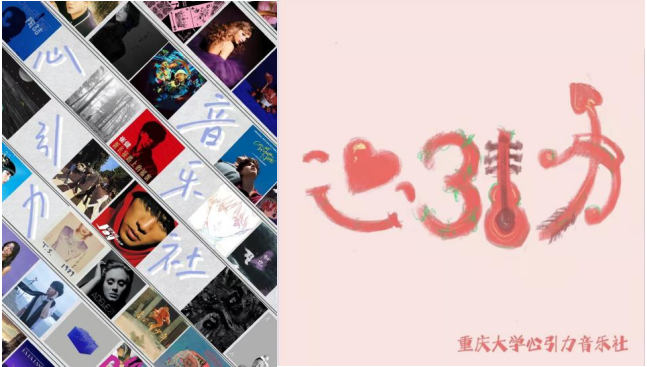

!!! quote "把爱留在心引力！"

!!! info "联系方式"
    * 纳新群号：`917211424`

## 社团简介  
为响应教育部发出的“切实加强新时代高等学校美育工作的意见”，丰富学生的课余活动、积极建设校园潮流文化，学生心引力音乐社在重庆大学诞生了。学生心引力音乐社不仅将重庆大学里热爱音乐的同学们聚集到一起，更是为这些同学们提供了一个展示自己的平台，实现自己的音乐梦。  

  
提到心引力音乐社为大家带来了什么，大家的答案不约而同的都是“友谊”。在社团里，有机会结识志同道合的朋友，共同探索音乐的奥秘和魅力。同学们一起练习乐器、创作歌曲、举办音乐会，通过这些活动，建立了深厚的友谊。大家互相支持、鼓励和理解，无论是在音乐上还是在生活中，大家都愿意为彼此付出时间和精力。正因为音乐社的友谊是建立在共同兴趣和目标基础上的，对音乐的热爱让大家走到了一起。所以这种热爱也成为了友谊的核心，一起分享音乐的快乐和挫折，一起追求更高的音乐境界。这种共同的经历和目标让成员们更加紧密地联系在一起，形成了坚不可摧的友谊。此外，音乐社的友谊还带来了许多宝贵的经验和支持。在音乐社里，成员们有机会接触各种各样的音乐风格和技巧，不断拓展视野和技能。朋友们经常互相提供有益的建议和批评，帮助不断提高音乐水平，也感受到温暖和关爱。  
重庆大学学生心引力音乐社是重庆大学音乐文化的交流平台，每届音乐社成员都会竭尽全力为同学们谋福利打造更多的音乐文化盛典。心引力音乐社一直坚持“以文化人，以美育人”的方针，积极配合学校进行优秀校园文化建设。同时，学生心引力音乐社立志于聚合更多喜欢各种音乐文化的同学，并为所有怀有歌唱梦想的同学提供一个交流和展示的平台，一起“把爱留在心引力！”。  

## 社团特色活动  
自创立以来，学生心引力音乐社举办了很多大型活动，其中最令人印象深刻的莫过于2023秋季学期在科学城校区风雨操场上举办的蓝莓音乐节活动。从“华语流行”到“kpop”，从“陶喆”到“泰勒斯威夫特”，整场音乐节含括了流行歌曲、摇滚朋克、激情说唱等多方面内容，极大地满足了同学们多种多样的观演需求，让同学们在紧张的学习之际也能够充分得到放松，并且体验感受到音乐的美好。相信这场上千人的音乐会能够为大家留下深刻的青春印象，也能在大家的心里埋下一颗关于音乐梦想的种子。  

  

  
此外不定期举办的多样主题的草坪音乐会、周杰伦，薛之谦专辑试听会等活动也给同学留下了深刻的印象，其中Taylor Swift（泰勒斯威夫特）系列新专试听会是最受欢迎的，其通过将同学们的音乐爱好与外语学习巧妙融合，在课余时间里培养了同学们的跨学科素养，同时培养了世界一流大学学子的国际化视野，获得了老师同学们的一致好评。  

  