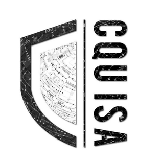

!!! info "联系方式"
    * 纳新群号：`973918106`  
    * 社团工作邮箱：`cquisa@126.com`  
    * 社长邮箱：`cooorgi@126.com`  

## 社团简介  
重庆大学信息安全协会（简称CQUISA）是计算机学院指导下的专业性社团，目的为提高重大学子网络安全技能、网络安全意识、计算机领域综合能力， 为重庆大学在信息安全竞赛方面赢得相关荣誉。协会以信息安全专业的同学为主，主要活跃于各种CTF赛事。协会为同学们提供了一个良好的交流平台让同学们得以在此共同学习与进步，协会在CTF中多个领域中技术氛围浓厚，是重庆大学第一个以信息安全为主打的技术性社团。  

  

## 部门划分  
#### 组织部  
组织部主要负责策划并开展活动，以及与校内其他社团和校外企业等合作交流。  
#### 宣传部  
宣传部主要负责活动宣发，公众号、官Q和网站的运营，是维护社团的形象的关键部门。  
#### 办公室  
办公室主要负责社团的一些文书工作，比如志愿时长申报、比赛费用报销、活动后文书归档等工作，是社团的大管家。  
#### 技术部  
技术部主要负责社团知识库的维护和完善，网站、平台、题目环境的维护，收集并发布比赛讯息，培训新人，参加各项CTF赛事，是社团的核心部门。  

## 社团特色活动  
#### 信息安全技能选拔赛  
以“以赛促学、以赛促教、以赛促改、以赛促创”为主题，提高重庆大学学生对于网络空间安全知识和技能的掌握。”比赛在ctf.cquisa.com上进行，为期7天。比赛形式为传统的CTF竞赛，即每道题目提交相应的 Flag 即可获得分数，比赛结束后参赛成员撰写并提交write up。  
#### 信息安全技术培训会  
线下开展网络信息安全相关技术的培训，方向有web安全、杂项、区块链等，同时也会讲解相关工具的使用。  
#### 信息安全技术交流会  
社团成员交流学习中的感悟和经验，以及计算机领域的热门话题和最新成果等。  
#### CTF  
**CTF**（Capture The Flag，夺旗赛）起源于 1996 年 **DEFCON** 全球黑客大会，以代替之前黑客们通过相发起真实攻击进行技术比拼的方式；其将安全相关的知识点抽象出来并加入到题目中，我们通过对知识点的理解认知，具体地进行实践来攻克题目。 信息安全已经渗透到社会的各个方面，各类重要信息系统已成为国家关键基础设施。 网络安全人才的培养已成为当前教育界、学术界和产业界共同关注的焦点问题。 CTF是网络空间安全人才培养方式的一种重要探索，兴趣是年轻人学习的最好动力， CTF比赛很好地将专业知识和比赛乐趣相结合，为同学们学习信息安全提供了一中有效的方式。  
!!! info "什么是 Flag？"  
    参赛团队之间通过进行攻防对抗、程序分析等形式，率先从主办方给出的比赛环境中得到一串具有一定格式的字符串或其他内容，并将其提交给主办方，从而夺得分数。为了方便称呼，我们把这样的内容称之为“Flag”。  
#### 网络攻防（WEB）  
在 CTF 竞赛中，WEB 也是占比重很大的一个方向之一，WEB 类的题目种类繁多，知识点细碎，时效性强，能紧跟时下热点漏洞，贴近实战。 WEB 类的题目包括但不限于：SQL 注入、XSS 跨站脚本、CSRF 跨站请求伪造、文件上传、文件包含、框架安全、PHP 常见漏洞、代码审计等。  
#### 逆向工程（Reverse）  
软件代码逆向主要指对软件的结构，流程，算法，代码等进行逆向拆解和分析。涉及 Windows、Linux、Android 平台的多种编程技术，要求利用常用工具对源代码及二进制文件进行逆向分析，掌握 Android 移动应用 APK 文件的逆向分析，掌握加解密、内核编程、算法、反调试和代码混淆技术。主要应用于软件维护，软件破解，漏洞挖掘，恶意代码分析。  
#### 二进制安全（PWN）  
PWN 是一个黑客语法的俚语词 ，是指攻破设备或者系统 。发音类似"砰"，对黑客而言，这就是成功实施黑客攻击的声音——砰的一声，被"黑"的电脑或手机就被你操纵了 。在 CTF 比赛中它代表着溢出类的题目，其中常见类型溢出漏洞有整数溢出、栈溢出、堆溢出等。主要考查参赛选手对漏洞的利用能力。  
#### 杂项（MISC）  
Misc 是英文 Miscellaneous 的前四个字母，杂项、混合体、大杂烩的意思。 Misc 在国外的比赛中其实又被具体划分为各个小块，有 - Recon - Forensic - Stego - Misc - …… Misc 是切入 CTF 竞赛领域、培养兴趣的最佳入口。Misc 考察基本知识，对安全技能的各个层面都有不同程度的涉及，可以在很大程度上启发思维。  
#### 密码学（Crypto）  
密码学（Cryptography）一般可分为古典密码学和现代密码学。而对于密码破解者来说，一般是要想办法识别出密码算法，然后进行暴力破解，或者利用密码体制的漏洞进行破解。当然，也有可能通过构造虚假的哈希值或者数字签名来绕过相应的检测。  
#### 移动安全（Mobile）  
主要分为 Android 和 iOS 两个平台，以 Android 逆向为主，破解 APK 并提交正确答案。  
#### 人工智能安全（AI）  
随着 OpenAI 掀起的这场大模型狂潮中，人工智能这个“旧时王谢堂前燕”也已经“飞入寻常百姓家”。越来越多的优秀的人工智能赛题出现在 CTF 比赛中，大致有这些：数据投毒、对抗样本、逆向工程、模型应用、后门模型、数据篡改和评估、模型窃取等。  
#### 物联网安全（IoT）  
物联网 (IoT)设备是计算机化的互联网连接对象，例如联网安全摄像头、智能冰箱和支持 WiFi 的汽车。物联网安全是保护这些设备并确保它们不会将威胁引入网络的过程。  
任何连接到互联网的东西都可能在某个时候面临攻击。攻击者可能尝试使用各种方法远程破坏物联网设备，其方法涵盖凭证盗窃到漏洞利用等等。一旦他们控制了物联网设备，就可以利用它来窃取数据、进行分布式拒绝服务 (DDoS) 攻击，或尝试入侵连接网络的其余部分。  
#### 区块链安全（blockchain）  
区块链是一个共享的、不可篡改的账本，旨在促进业务网络中的交易记录和资产跟踪流程。 资产可以是有形的（如房屋、汽车、现金、土地），也可以是无形的（如知识产权、专利、版权、品牌）。几乎任何有价值的东西都可以在区块链网络上跟踪和交易，从而降低各方面的风险和成本。  
区块链安全主要涉及智能合约安全审计、链安全审计、安全检测、区块链威胁情报等。  

## 附件  
- 社团纳新海报：  
    

  