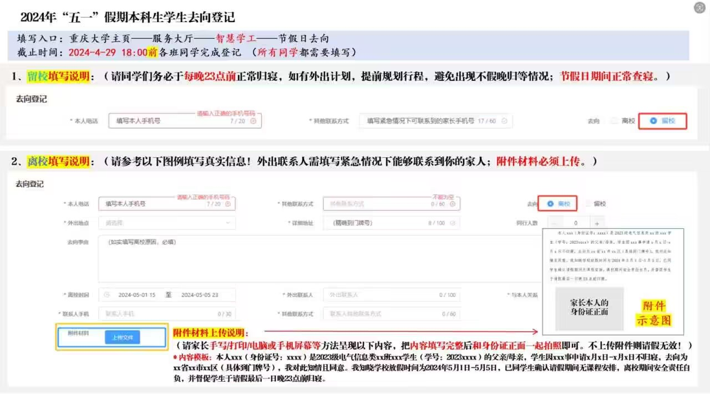

1. 五一放假时间：5月1日-5月5日，无特殊情况不延长或者提前请假。  
    特别提醒：4月28日（星期日）、5月11日（星期六）是国家调休，属于正常行课时间。  
2. 离校流程：  
    1. 【所有同学】需在4月29日（下周一）18:00前通过【智慧学工】平台【节假日去向】板块完成去向登记。离校学生将家长知情同意书上传到板块附件中，具体操作如图：  
        

  
        - 【无长期假条同学】请按内容模板：本人\[父/母\]\_\_\_\(身份证号：\_\_\_\)是2023级新工科xx班xxx学生（学号：2023xxxx）的父亲/母亲，学生因xxx事申请x月x日-x月x日不归寝，去向为xx省xx市xx区（具体到门牌号），我对此知情且同意。我知晓学校放假时间为2024年5月1日-5月5日，已同学生确认请假期间无课程安排，离校期间安全责任自负，并督促学生于请假最后一日晚23点前归寝。（请家长手写/打印/电脑或手机屏幕等方法呈现以下内容，填写完整后和身份证正面一起拍照即可，由学生上传至附件，方可离校，否则视作不假离校处理。）   
        - 【长期假条】同学请在离校原因处备注下“本人持有长期假条，因……事离校”，并在附件处上传家长发给班长的短信截图。（信息模板：本人\[父/母\]\_\_\_\(身份证号：\_\_\_\)系xx班学生xxx父亲/母亲，学生于x月x日x时离校，将于x月x日x时前返校，请知悉。）  
    2. 离校申请截止时间为4月29日18:00，4月30日为审核及公示期，假期内不接受临时请假。  
3. 寝室管理：  
    1. 4月30日晚和5月5日晚学校将组织查寝，五一假期正常查寝。未按要求请假外宿（包含晚归），视情节轻重给予群内通报批评到校级处分；  
    2. 请年级干部安排好点名工作，严格查寝。  