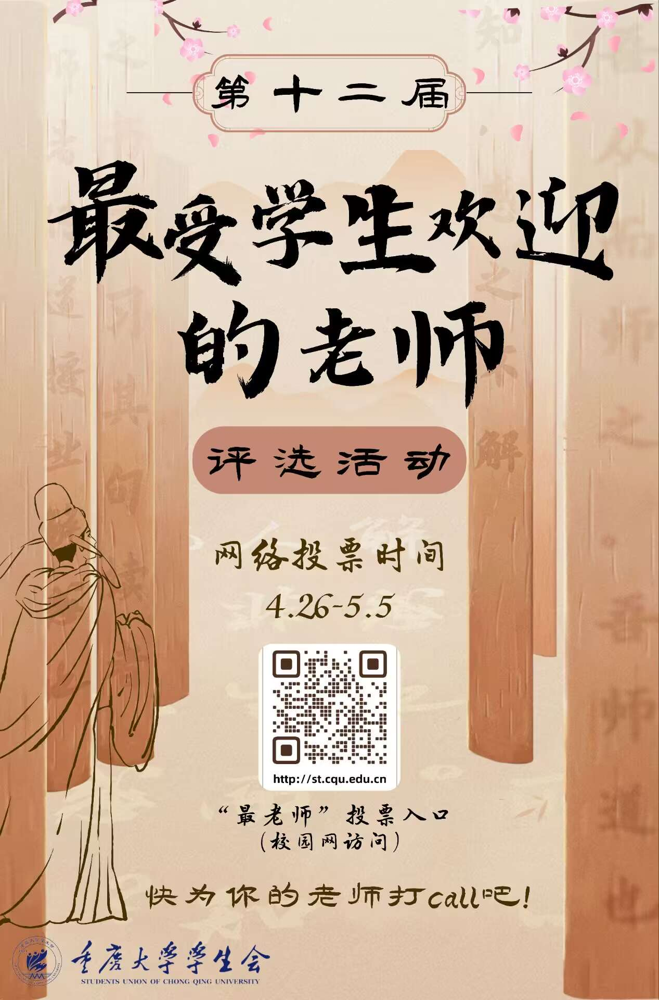

【最老师 | 第十二届“最受学生欢迎的老师”评选活动】  
✨落其实者思其树，饮其流者思其源。  
🎊这一路走来，不计其数的老师教导着、帮助着、扶持着我们，带领我们褪去稚气，走向成熟。你是否曾为Ta幽默风趣的教学风格所吸引？是否被Ta的某一段话语所打动？是否因Ta认真负责的态度而钦佩？请让我们为心目中的那个Ta投下宝贵的一票！  
🔗投票链接：  
[http://st.cqu.edu.cn](http://st.cqu.edu.cn)  
⏰网络投票时间：  
4月26日-5月5日  
📙投票规则：  

1. 每位同学可于网络投票期登陆“最受学生欢迎的老师”评选活动网站,投选自己最喜爱的5位教师。  
2. 投票期结束后，将结合材料评审情况，遴选出票数排行前15名老师进入最终的线下风采展示环节。  

❗网络投票环节占总分数40%  
🎲分数算法:  
最高投票数的老师取为40分，其他按投票数比例折算计分，本环节结束后将公布本轮结果。  
🎉快点击链接pick你最看好的那位老师吧！  

  